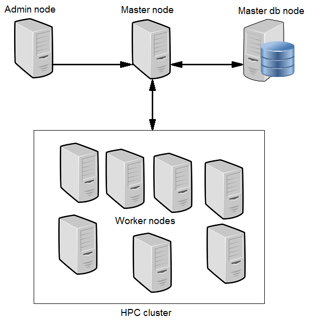

PRUN: Parallel task executor and job scheduler in a high-availability computing clusters
----------------------------------------------------------------------------------------

PRUN is a high-throughput computing (HTC) software framework for coarse-grained
distributed parallelization of computationally intensive tasks.
It provides a queueing mechanism, scheduling, priority scheme, execution and
failover of short-term or long-term tasks on the computer cluster.
Prun can be compiled and used on Unix-like operating systems, including Linux
and *BSD.

PRUN simplified architecture
----------------------------

Where to find complete Prun documentation?
-------------------------------------------

This README is just a fast "quick start" document. You can find more detailed
documentation at doc/README

Building
--------

Build requirements:

- cmake 2.6 (or higher)
- GCC 3.x (or higher) or Clang
- boost 1.47 (or higher)

Additional requirements:

- python 2.6/3.x (for command-line admin tool & other purposes)
- LevelDB (for serialization of submitted tasks)

For running jobs written in Ruby, JavaScript or Java, requirements are as follows:

- ruby
- node.js
- java 1.6 (or higher)

Building runtime::

> cd ~/prun               # cd to the directory containing prun
> cmake -DRelease=true .  # skipping Release var disables compiler optimizations
> make                    # build executables

Running
-------

Running Worker in terminal::

> ./pworker

Running Worker as a daemon with paths to config file and special node directory::

> ./pworker --d --c /home/user/prun/worker.cfg --r /home/user/prun/node  # start
> ./pworker --s  # stop daemon

Use 'pworker --help' to display command line options.

Running Master in terminal::

> ./pmaster

Running Master as a daemon with path to config file::

> ./pmaster --d --c /home/user/prun/worker.cfg  # start
> ./pmaster --s  # stop daemon

Use 'pmaster --help' to display command line options.

Installation
------------

If you are installing Prun the proper way for a production system, we have a script
doing this for Ubuntu and Debian systems (upstart) or SysV-init compatible systems::

> cd ~/prun                  # cd to the directory containing prun
> utils/install_master.sh    # install Master
> utils/install_masterdb.sh  # install Master's database server
> utils/install_worker.sh    # install Worker

The script will ask you a few questions and will setup everything you need
to run Master/Worker properly as a background daemon that will start again on
system reboots.

You'll be able to stop and start Master/Worker using the script named
/etc/init.d/pmaster and /etc/init.d/pworker, accordingly.

Job submitting
--------------

Here's a simple example of external sort task. Let's assume that we have
network-shared directory named 'data', which is read/write available from any
node in a cluster. So we need parallelize sorting of a big text file.

One solution is to sort a separate small pieces of a file and then merge them into
one big sorted file. Small pieces of a file are called chunks. We can submit a job
that sorts chunks from Master to Workers. Here's a simple shell script (see
jobs/example/sort_chunk.sh) that does it properly::

  echo "Sorting chunk process started"
  echo "taskId="$taskId", numTasks="$numTasks", jobId="$jobId

  filename="data/input.txt"
  outFile="data/$taskId"

  fileSize=`stat --printf="%s" $filename`
  partSize=`expr $fileSize / $numTasks`

  dd if=$filename bs=$partSize skip=$taskId count=1 | sort --buffer-size=$partSize"b" > $outFile
  errCode=${PIPESTATUS[0]}

  exit $errCode

For submitting a chunk sorting job, we should describe it in a .job file (see
jobs/sort_chunk.job), that is written in JSON format (see doc/README for more
detailed description)::

  {
      "script" : "example/sort_chunk.sh",
      "language" : "shell",
      "send_script" : true,
      "priority" : 4,
      "job_timeout" : 1800,
      "queue_timeout" : 300,
      "task_timeout" : 300,
      "max_failed_nodes" : 10,
      "num_execution" : 16,
      "max_cluster_cpu" : -1,
      "max_cpu" : 1,
      "exclusive" : false,
      "no_reschedule" : false
  }

In a few words this job should be executed 16 times, using exactly one CPU of a
Worker node and should be done within 1800 seconds. It means that if we have
16 Worker nodes (computers/CPUs), each worker node will sort one of sixteen
chunks of the input big file. Even if we have only one worker, chunk sorting
job will be executed sixteen times.

After sorting chunks, this chunks could be merged together in one big output file.
Here's a simple shell script (see jobs/example/sort_merge.sh) which does
it properly::

  echo "Chunk merging process started"
  echo "taskId="$taskId", numTasks="$numTasks", jobId="$jobId

  chunks=`ls -d data/*[0-9]`
  outFile="data/output.txt"

  sort --buffer-size=33% -T "data" -m $chunks > $outFile
  errCode=$?

  exit $errCode

And merge job description (see jobs/sort_merge.job)::

  {
      "script" : "example/sort_merge.sh",
      "language" : "shell",
      "send_script" : true,
      "priority" : 4,
      "job_timeout" : 1800,
      "queue_timeout" : 1800,
      "task_timeout" : 1800,
      "max_failed_nodes" : 10,
      "num_execution" : 1,
      "max_cluster_cpu" : -1,
      "max_cpu" : 1,
      "exclusive" : false,
      "no_reschedule" : false
  }

We want to run merging job strictly after completion of all chunk sorting jobs.
It is possible to describe job dependencies in a directed acyclic graph. Prun
takes that job dependencies from the .meta file. Here's a simple job dependency
between two jobs (see jobs/external_sort.meta)::

  {
      "graph" : [["sort_chunk.job", "sort_merge.job"]]
  }

Ok, we are almost done. We are having everything that is needed for sorting
the big file: running Workers across cluster nodes, one running Master process,
jobs and job descriptions, shared directory containing the input file
(data/input.txt). Lets submit job using command-line tool::

> cd ~/prun                        # cd to the directory containing prun
> ./prun master_hostname      # run admin tool, connect to Master host
> run external_sort.meta           # submit a meta job

License
-------

The contents of this repository are made available to the public under the terms
of the Apache License, Version 2.0. For more information see LICENSE.txt
